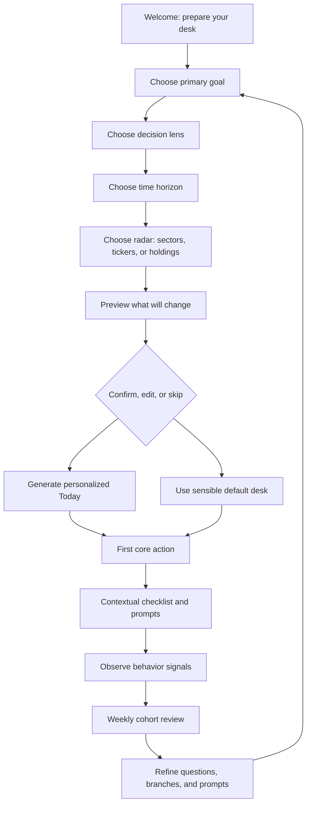

# Henneth Desk Personalized Onboarding Flow

## Product audit

Henneth Desk is not a blank productivity app. It already includes:

- **Core desk:** Ask, Today, Board
- **Your workflow:** Watchlist, Portfolio, Your Chart, Practice
- **Edge:** Strategies, Value, Screener, Compare, Scenarios, Research, Sectors, Marketplace, Scores
- **Market:** News, Macro, Dividends, Earnings, Astro, Tools

The current first-run cue is primarily “Add a stock to your watchlist.” Other parts of the product already expose personalized data, including portfolio holdings and a personalized chart view.

The onboarding should therefore feel like the desk is being prepared for the user, rather than like a generic product tour.

> “We already understand the shape of your investing workflow. Let’s tune the desk around it.”

## Research-backed principles

- Ask only questions that visibly change the experience.
- Use a short personalized checklist instead of a feature tour.
- Show the user what is being configured and why.
- Get the user to one meaningful action quickly.
- Keep advanced questions progressive and contextual.
- Make education skippable and resumable.

Reference patterns:

- [Apollo Home](https://knowledge.apollo.io/hc/en-us/articles/14845941738637-Home-Overview): personalized missions ordered around the earliest incomplete action.
- [Notion starter templates](https://www.notion.com/en-gb/help/start-with-a-template): onboarding answers select starter templates.
- [Linear start guide](https://linear.app/docs/start-guide): demo → workspace → first issue, with paths by team size and role.
- [Slack onboarding guidance](https://docs.slack.dev/app-management/onboarding-users-to-your-app/): first task quickly, then optional deeper education.
- [Firecrawl onboarding](https://www.firecrawl.dev/onboarding) and [AI onboarding](https://docs.firecrawl.dev/ai-onboarding): lightweight setup routed by integration goal.

## Proposed onboarding flow

### 1. Welcome

**Headline**

> Let’s prepare your desk around how you actually invest.

**Subtext**

> Four quick choices will tune your daily brief, watchlist, screeners, lessons, and market signals. You can change anything later.

Show progress:

> 1 of 4 · Calibrating your desk

Controls:

- Skip for now
- Save and continue later
- I already know what I want

### 2. Ask four high-signal questions

#### Question 1: What do you want the desk to help you do most?

- Find promising PSX ideas
- Monitor my existing holdings
- Understand the market each day
- Build a repeatable strategy
- Learn investing properly
- Explore the chart and Astro lens
- A bit of everything

**Effect:** Sets the primary landing experience.

#### Question 2: What is your main decision lens?

- Fundamentals and valuation
- Technicals and momentum
- Dividends and income
- Macro and sectors
- A balanced mix
- Astro as an additional lens

**Effect:** Changes the ordering and language of Today, Screener, Strategies, Practice, and Astro.

#### Question 3: What is your time horizon?

- Intraday / very short-term
- Several days to a few weeks
- Several months
- Long-term compounding
- I am still figuring this out

**Effect:** Changes catalyst emphasis, lesson recommendations, and explanation depth.

#### Question 4: What should we put on your radar first?

Allow the user to:

- Choose sectors such as banks, E&P, cement, technology, fertilizers, or OMCs.
- Add 3–5 tickers.
- Import or add holdings.
- Start with the desk’s current market read.

**Effect:** Creates value even when the user is only researching and does not yet have a portfolio.

### 3. Show the preparation happening

Use a short, transparent setup state:

> Preparing your desk for you
>
> ✓ Setting your daily brief to balanced explanations  
> ✓ Prioritizing banks and earnings catalysts  
> ✓ Loading a value-and-dividend screener  
> ✓ Choosing your first 8-minute lesson  
> ✓ Building your starting radar

Every item should be causally connected to the user’s answers.

### 4. Let the user confirm the result

Show a preview card:

> Your desk is ready
>
> **Profile:** Balanced, long-term PSX researcher  
> **Today:** Macro context first, then quality names and catalysts  
> **Radar:** Banks, E&P, and your selected tickers  
> **Next lesson:** The balance sheet, line by line  
> **Starting action:** Review today’s brief and save one name

Buttons:

- Looks right
- Edit my setup
- Start with a blank desk

Do not silently overwrite existing watchlists, portfolios, or chart data.

## Persona branches

### Idea finder

Prioritize Today → Screener → Strategies → Save first stock → Add to watchlist.

**Activation:** Save one stock from Screener or Today.

### Portfolio monitor

Prioritize Portfolio → Concentration / Portfolio X-ray → Earnings and dividends → Add or confirm holdings → Set risk reminders.

**Activation:** View Portfolio X-ray after confirming at least one holding.

### Market reader

Prioritize Today → Macro → News → Earnings → Ask the desk.

**Activation:** Open a personalized daily brief and ask one follow-up question.

### Learner

Prioritize Practice → Today’s lesson → Ask the desk → Compare → First saved concept or stock.

**Activation:** Complete the first lesson and apply the concept to one stock.

### Chart / Astro explorer

Prioritize Your Chart → Astro → Watchlist → Today → Practice.

If birth-chart data is missing, ask for it only after explicit consent. If it is already configured, confirm it instead of requesting it again.

## Personalized Today experience

After setup, Today becomes the onboarding home:

> Good morning. We prepared today’s desk around your long-term, fundamentals-first lens.

Show four cards:

- **Your brief:** today’s market tone and why it matters to the user’s profile.
- **Your radar:** selected stocks, sectors, and upcoming catalysts.
- **Your next move:** one recommended product action, such as “Review BML’s setup.”
- **Your next lesson:** a short lesson tied to the user’s stated goal.

Add a collapsible checklist:

- Add your first stock
- Review today’s personalized brief
- Open one company or sector page
- Save a screener
- Ask the desk one question
- Complete your first lesson
- Optional: confirm chart preferences

## Product loop

The product should learn from behavior, but never silently change stated preferences.

## Measurement

**Universal activation:** The user sees a personalized Today experience and completes one core action within 24 hours.

Secondary metrics:

- Time to first meaningful action
- First watchlist addition
- First portfolio confirmation
- First Ask question
- First lesson completion
- First screener save
- Three-day return
- Seven-day return
- Percentage of users who edit generated setup
- Percentage who skip onboarding but activate later

Do not optimize for onboarding completion alone. A user who skips the questions but saves a stock is more valuable than a user who completes the survey and leaves.

## Recommended MVP

Build first:

1. Four-question onboarding.
2. Profile preview before applying changes.
3. Personalized Today ordering.
4. Watchlist / holdings / lesson starter actions.
5. A collapsible checklist.
6. Skip-and-resume behavior.
7. Event tracking by selected goal and lens.

Defer:

- Deep integration setup
- Advanced notification rules
- Complex automation
- Large template libraries
- Mandatory chart or Astro setup
- Long educational tours

## Desired user feeling

> “The desk already feels like my desk.”
